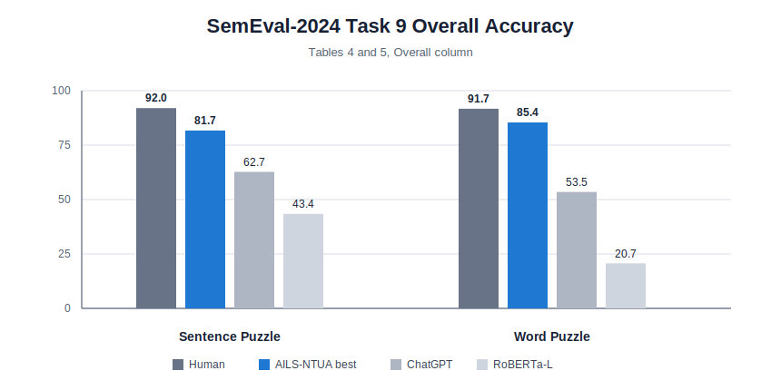
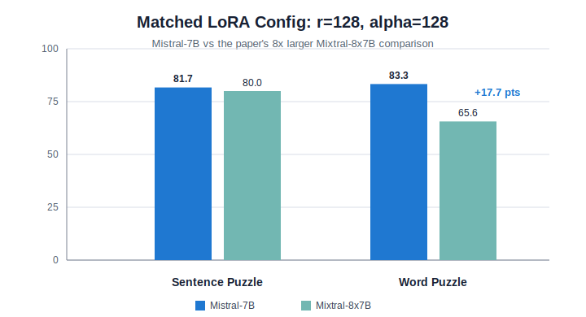
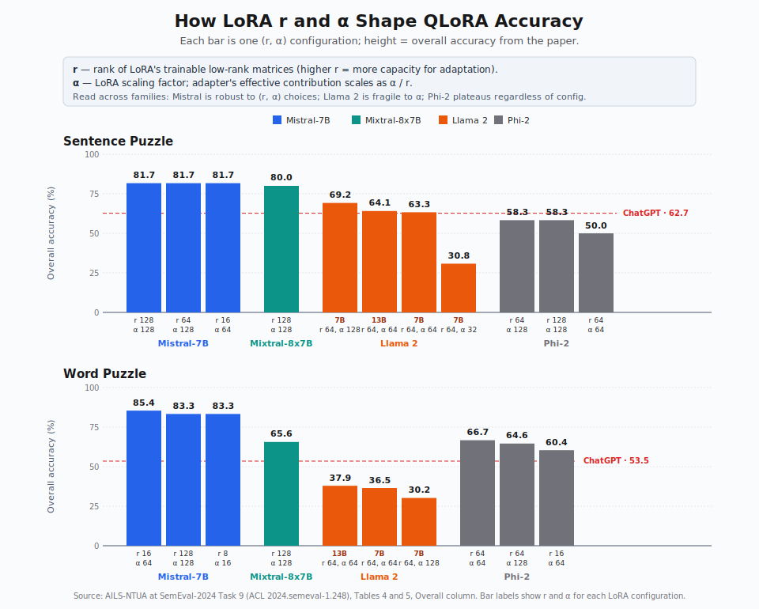

# Paper Results

All numbers below are from the ACL Anthology system paper:
[AILS-NTUA at SemEval-2024 Task 9](https://aclanthology.org/2024.semeval-1.248/).
The values are overall accuracies from Tables 4 and 5 unless otherwise noted.

## Headline Comparison

| System | Sentence Puzzle | Word Puzzle |
|---|---:|---:|
| Human | 92.0 | 91.7 |
| AILS-NTUA best Mistral-7B QLoRA | 81.7 | 85.4 |
| ChatGPT | 62.7 | 53.5 |
| RoBERTa-L | 43.4 | 20.7 |

## Matched Mistral vs Mixtral

At the matched `r=128`, `alpha=128` configuration, Mistral-7B reports 81.7 on
Sentence Puzzle and 83.3 on Word Puzzle. Mixtral-8x7B reports 80.0 and 65.6.
The paper describes Mixtral-8x7B as 8 times larger in this comparison.

## QLoRA Configurations

### Sentence Puzzle

| Model/config | Overall |
|---|---:|
| Mistral-7b_128_128 | 81.7 |
| Mistral-7b_64_128 | 81.7 |
| Mistral-7b_16_64 | 81.7 |
| Mixtral-8x7b_128_128 | 80.0 |
| Llama 2-7b_64_128 | 69.2 |
| Llama 2-13b_64_64 | 64.1 |
| Llama 2-7b_64_64 | 63.3 |
| Phi-2_64_128 | 58.3 |
| Phi-2_128_128 | 58.3 |
| Phi-2_64_64 | 50.0 |
| Llama 2-7b_64_32 | 30.8 |

### Word Puzzle

| Model/config | Overall |
|---|---:|
| Mistral-7b_16_64 | 85.4 |
| Mistral-7b_128_128 | 83.3 |
| Mistral-7b_8_16 | 83.3 |
| Phi-2_64_64 | 66.7 |
| Mixtral-8x7b_128_128 | 65.6 |
| Phi-2_64_128 | 64.6 |
| Phi-2_16_64 | 60.4 |
| Llama 2-13b_64_64 | 37.9 |
| Llama 2-7b_64_64 | 36.5 |
| Llama 2-7b_64_128 | 30.2 |

## Encoder Notes

The strongest encoder overall results reported in Tables 4 and 5 are:

| Encoder | Sentence Puzzle | Word Puzzle |
|---|---:|---:|
| RoBERTa-WNGRD | 78.4 | 63.5 |
| DeBERTaV3-base | 71.7 | 68.7 |
| DeBERTaV3-TS | 76.7 | 66.6 |

These are paper-era results and should be cited as SemEval-2024 system-paper
results, not as current model claims.
